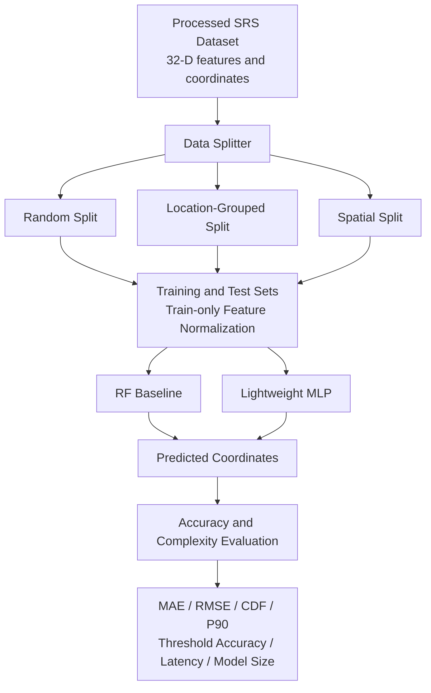

# Project Planning: Improving Spatial Generalization of SRS-Based Indoor Localization

## Reference

- Reference Paper:
  - Ping-Yu Hsieh, Chieh-Chun Chen, Navid Nikaein, and Ray-Guang Cheng, "Uplink SRS-Based Real-Time Indoor Localization System over OpenAirInterface," manuscript, 2026.

- Project direction:
  - Reuse the processed 32-dimensional SRS feature dataset from the reference paper.
  - Replace the Random Forest (RF) regressor with a lightweight Multilayer Perceptron (MLP).
  - Evaluate whether the MLP improves localization at spatial locations excluded from training.
  - Conduct the project offline without deploying a live Radio Unit (RU), OpenAirInterface, E2 interface, or Positioning xApp.

---

# Basic Information

| Item | Information |
|---|---|
| Project Title | Improving Spatial Generalization of SRS-Based Indoor Localization Using a Lightweight MLP |
| Student ID / Name |M11502203 Ping-Yu,Hsieh |
| Git Repository / Project Link | |
| Planning Approval Date | YYYY-MM-DD (The project starts being evaluated after approval by both instructors.) |

---

# Part A. Detailed Project Planning

## A1. Project Summary

- **Problem to be solved:**
  Indoor radio fingerprinting models can achieve very low localization error when training and testing frames are randomly sampled from the same measurement locations. However, this evaluation may be optimistic because highly correlated frames from one coordinate can appear in both sets. In the reference paper, the RF model achieves a mean localization error of 0.1238 m under an 80/20 random split, but its error increases to 1.78 m when complete spatial regions are excluded from training. This project investigates whether a model that learns a continuous mapping from radio features to coordinates can improve localization at unseen positions.

- **Key challenges:**
  The processed SRS features have a nonlinear relationship with physical position because of indoor multipath propagation. A fair comparison must also prevent location leakage, keep all frames from one coordinate in the same data partition, and use identical inputs and test samples for both models. The proposed model must improve spatial generalization without introducing excessive training cost, model size, or inference latency.

- **Proposed method:**
  Use the existing 32-dimensional feature vectors and their two-dimensional position labels. Train a lightweight MLP with two hidden layers to predict the \((x,y)\) coordinate. The original RF configuration will be reproduced as the baseline. Both models will be evaluated using random, location-grouped, and spatially separated splits. Feature extraction and live SRS collection are outside the implementation scope.

- **Expected outcomes:**
  Determine whether the MLP reduces localization error in unseen spatial regions while retaining practical inference speed. The project will also quantify how strongly reported accuracy changes with the data-splitting strategy. A negative result remains informative if it shows that changing the regression model alone is insufficient to overcome spatial domain shift.

---

## A2. System Architecture

### System Assumptions

- The existing dataset contains one processed 32-dimensional SRS feature vector and one ground-truth coordinate \((x,y)\) for each frame.
- The 32 features follow the reference paper's representation:
  - 16 normalized Power Delay Profile (PDP) features
  - 8 inter-antenna phase features
  - 8 received-power and spatial-symmetry features
- The primary experiment uses data from the same 6m* 6m indoor laboratory as the reference paper.
- All frames associated with the same coordinate are assigned to only one data partition in the location-grouped and spatial evaluations.
- The same feature vectors, partitions, and evaluation metrics are used for RF and MLP.
- This project evaluates within-environment spatial generalization. It does not claim cross-room, cross-device, or cross-day generalization.
- No live RU, gNB, OAI deployment, E2 connection, or real-time xApp is required.

### Environment

- **Dataset environment:**
  - Processed SRS feature vectors collected in the reference paper's indoor experiment
  - Ground-truth two-dimensional coordinates
  - Coordinate or region identifiers used to construct leakage-resistant data splits

- **Software environment:**
  - Python-based offline training and evaluation
  - A standard machine-learning framework for RF and MLP regression
  - CPU-based inference; GPU training may be used if available but is not required

### Input Parameters

- 32-D: processed SRS feature vector
- (x,y): ground-truth two-dimensional coordinate
- Split type: random, location-grouped, or spatially separated
- MLP configuration:
  - Input layer: 32 features
  - Hidden layers: 64 and 32 neurons with ReLU activation
  - Output layer: 2 neurons for (x,y)
  - Training parameters: learning rate, batch size, number of epochs, and early-stopping patience
- RF baseline configuration:
  - 100 trees
  - Maximum depth of 12
  - Minimum samples per split of 20

### Output Parameters

- (x,y): estimated two-dimensional coordinate
- e_i: Euclidean localization error for sample i
- Mean, median, RMSE, and 90th-percentile localization error
- Percentage of predictions within 0.5 m and 1.0 m
- Model size, training time, and per-sample inference latency

### Proposed Modules and Information Flow

The normalization parameters are fitted only on the training partition and then applied to validation and test data. This prevents information from the test set from entering model training.

---

## A3. Expected Deliverables and Validation

### Expected Deliverables

- A reproducible dataset loader and data-partitioning script
- An implementation of the RF baseline from the reference paper
- A lightweight MLP localization model
- Training and evaluation scripts using identical partitions for both models
- Error CDF, error-distribution, and predicted-versus-ground-truth plots
- A results table comparing accuracy, model size, and inference latency
- A final report describing the method, results, limitations, and conclusions

### Validation Method
RMSE, median error, 90th-percentile error, the empirical error CDF, and the percentages below 0.5 m and 1.0 m will also be reported. Each model comparison will use identical data partitions. Results over at least five random seeds will be reported as mean and standard deviation when training randomness applies.

### Experiment Scenario 1: Reference Baseline Reproduction

- **Design:**
  Reproduce the reference paper's 80/20 random frame split and RF configuration. Train the MLP on the same partition and compare both models.

- **Baseline:**
  RF from the reference paper

- **Purpose:**
  Confirm that the offline pipeline is implemented correctly and establish how the MLP performs under the original evaluation setting.

- **Expected result:**
  The reproduced RF result should be reasonably close to the reported random-split result, subject to access to the original preprocessing, split seed, and software settings. This scenario is a consistency check rather than the main evidence for spatial generalization.

### Experiment Scenario 2: Location-Grouped Evaluation

- **Design:**
  Group samples by ground-truth coordinate before partitioning. All frames from one coordinate must appear entirely in training, validation, or testing. Compare RF and MLP on the same held-out coordinates.

- **Baseline:**
  RF using the same 32-dimensional inputs and grouped partitions

- **Purpose:**
  Prevent correlated frames from the same measurement point from appearing in both training and testing, and evaluate localization at unseen coordinates.

- **Expected result:**
  Both models may have higher error than under the random split. The MLP is expected to provide smoother coordinate estimates and may reduce error relative to RF, but this hypothesis will be accepted or rejected based on the measurements.

### Experiment Scenario 3: Spatially Separated Blind Evaluation

- **Design:**
  Exclude one or more contiguous spatial regions from model training and use them only for testing. If the dataset permits, repeat the experiment with different held-out regions rather than reporting only one region.

- **Baseline:**
  RF under the identical spatial split

- **Purpose:**
  Evaluate whether the MLP generalizes to areas that are spatially separated from the training coordinates and determine whether it improves on the 1.78 m RF result reported in the reference paper.

- **Expected result:**
  The experiment will show whether replacing RF with an MLP is sufficient to improve within-room spatial generalization. The conclusion will be based on accuracy across all tested regions, not on the best individual region.

### Experiment Scenario 4: Computational-Cost Evaluation

- **Design:**
  Measure model size, training time, and per-sample inference latency using the same computer and software environment. Use a warm-up phase before timing inference and report the average over repeated predictions.

- **Baseline:**
  RF with 100 trees versus the lightweight MLP

- **Purpose:**
  Determine whether any accuracy improvement is obtained at a practical computational cost.

- **Expected result:**
  The MLP should remain small enough for offline training and low-latency inference. This project will report measured latency rather than claiming end-to-end real-time performance, because the live radio and E2 pipeline are outside its scope.

---

## A4. Cross-Validation

| Validation Question | Analysis | Conclusion |
|---|---|---|
| **Can the proposed contributions address the identified challenges?** | **Optimistic random-split accuracy:** location-grouped and spatial splits prevent frames from a held-out coordinate or region from leaking into training. **RF spatial generalization:** the MLP learns a continuous nonlinear mapping from the same features to coordinates and is a plausible alternative to RF's piecewise-constant predictions. **Fair comparison:** both models use the same inputs, partitions, and metrics. **Complexity:** model size and latency are explicitly measured. An MLP may still fail under strong spatial domain shift, so improvement is treated as a testable hypothesis rather than an assumed result. | ✓ Experiment design aligned with the problem |
| **Will the planned experiments provide sufficient evidence that the proposed method solves the problem?** | The random split checks consistency with the reference work. The location-grouped and spatially separated evaluations directly test performance at unseen coordinates, while repeated seeds and tail-error metrics assess stability. These experiments can support conclusions about model choice within the recorded laboratory. Because the dataset covers only one environment, they cannot establish cross-room, cross-device, or cross-day generalization. | ⏳ Pending experiments; sufficient for the stated within-environment scope |

---

# Planning Checklist

The project should answer the following questions clearly:

1. How much of the reported localization accuracy depends on the data-splitting strategy?
2. Does a lightweight MLP outperform the RF baseline at unseen coordinates or spatial regions?
3. What accuracy-versus-complexity trade-off does the MLP provide?
4. Are all conclusions limited to conditions that the available dataset can actually test?
